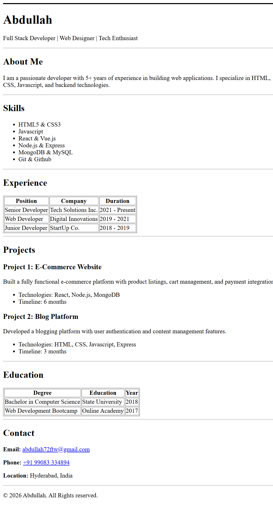

# README.md

## HTML Resume Page

A single-page HTML resume website showcasing a clean and structured layout. This project demonstrates proper HTML semantics, headings, tables, lists, and sections without CSS. The page includes sections such as About, Skills, Experience, Projects, Education, and Contact. (GitHub)

## Live Demo

View the live deployed version of the resume here:  
<https://html-personal-resume.netlify.app/>

## Screenshot

  

## Video Demo

Watch a demo of the project here:  
[Video Demo Link](assets/Video.mp4)

## Installation

**Clone the repository and navigate to the project folder:**

```bash
# Clone the repository
git clone https://github.com/abdcantcode/Html-resume-project.git

# Navigate to the project folder
cd Html-resume-project

**Open the resume in your browser:**

- Double‑click the `index.html` file  
- Or right‑click → Open with → your preferred browser

## Usage

- Scroll through the resume to view sections like **About**, **Skills**, **Experience**, **Projects**, **Education**, and **Contact**.  
- This can be used as a template for your own personal resume page.  
- Since no CSS is included, the structure is semantic and ideal for further customization.
